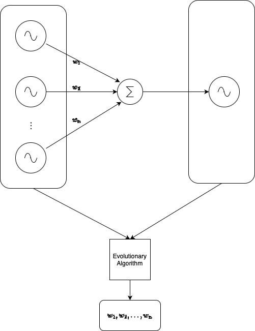

## Time Series Decrypter
This is an evolutionary algorithm that takes in 2 or more time series, and a unknown weighted summation of them, and return an the weightage of those wave forms. A conceptual representation is shown in the figure below:

Unlike Inverser Fourier Transform, this algorithm is capable of resolving weighage of **completely noisy signals**.